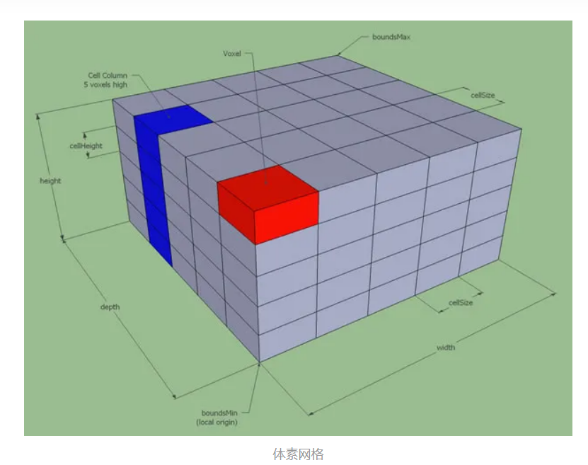
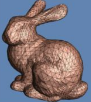
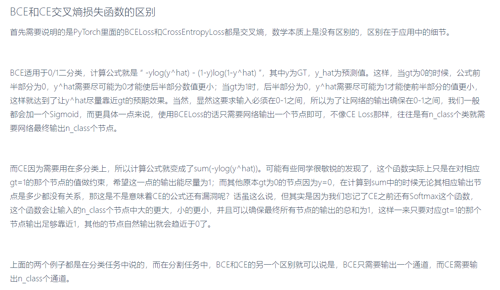
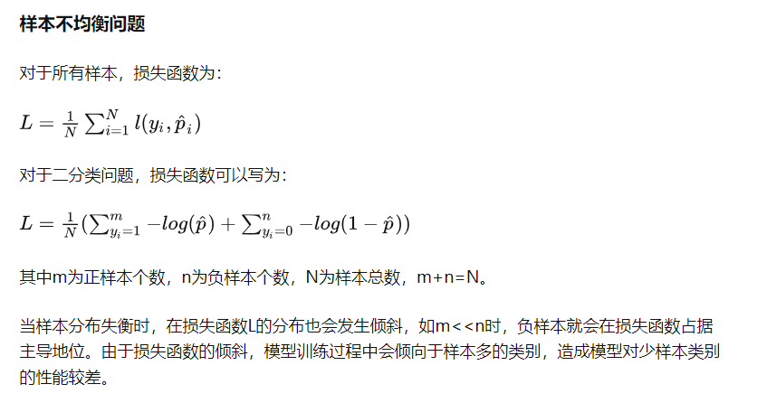
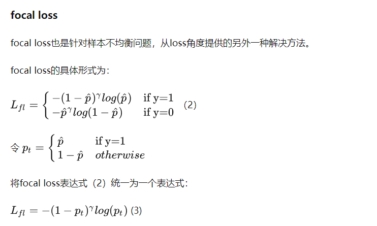
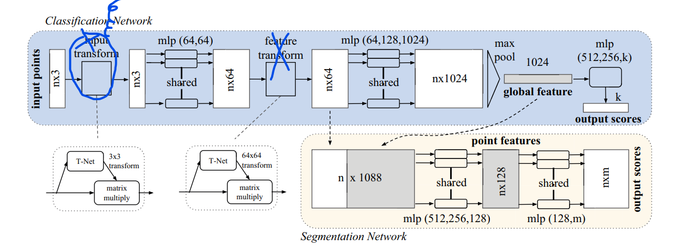
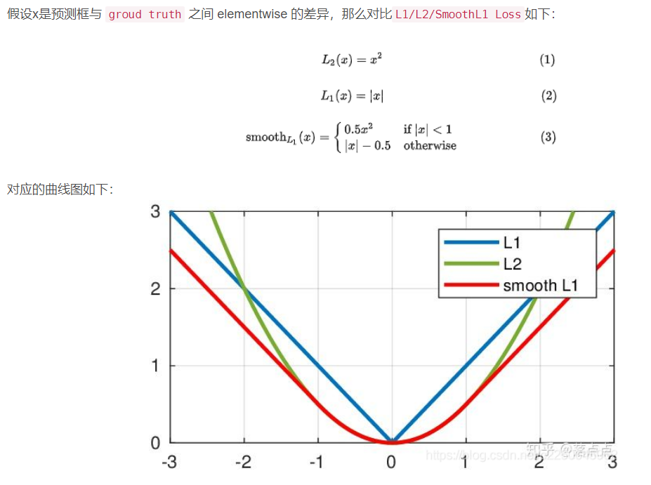
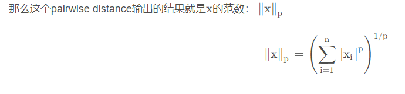

# 想法
## 基于transformer和center-points 的目标检测
* 对center-point用聚类算法
## 对于传统目标检测算法强调学习目标的特征(颜色)
* 先关注目标的形状，再关注目标的特征
* 我认为可以用类似u-net 的网络通过反卷积取出边界特征，再把强调边界特征图做为transformer的K

# 数据集格式
## labelme
* 左上和右下
## COCO
* 左上和宽高

# transformer
* vis tranformer 主要用了 transformer 中的encoder结构外加一个cls分类符
* detr 用了整个transformer结构 + 共享FFN用于预测目标和回归
  * encoder学习的是特征之间的联系
  * decoder学习的是数据特征的分布(用queries 反映)
* deformable detr 结合了可变性卷积的思想

# deformable convolutional networks
* deformable convolution
* deformable  ROI pooling

<b>*****************************************************************************</b>

<b>*****************************************************************************</b>

# 3D数据的表示
##  point cloud
* (x,y,z)坐标的集合
## voxel grids
* 3D occupancy grid map
* 我的世界里面的方格
* 
## Polygon meshes
* 多面片
* 
# sparse convolution

# 损失函数BCE，CE，MSE
# BCE
 
 
 
# NLL-loss
* 输出tensor->softmax->log->NLL-loss=CE
* NLL-loss ::= 把softmax和log后的输出与Label对应的那个值拿出来，去掉负号，再求均值。 

<b>*****************************************************************************</b>

<b>*****************************************************************************</b>

# 点云的性质point cloud

* <b>点云数据unordered，非结构化数据，直接用CNN很难</b>
* 只能提供三维结构信息，不包含语义、纹理信息
* 近密远疏

# point net(点云特征提取网络)
## PointNet: Deep Learning on Point Sets for 3D Classification and Segmentation

* 无序性 
  *  symmetric对称函数设计用于表征(Key to our approach is the use of a single )
* 点不是孤立的，需要考虑局部和整体 
  * 设计局部全局特征结合网络
  * 
* ~~ 仿射变换无关性 --> alignment network +T-net ~~

# voxel net(3D目标分类CNN网络)
* 基于空间像素 和point net结合

# VoxelNeXt（稀疏3D点云）

## VFE voxel feature encoding
一种点云转体素，再特征提取的方法

# SLAM
* simultaneously locating and mapping
* 同步定位于地图构建
* occupancy grid 占据栅格

# 想法
* 一般类似centerNet，FCOS这样基于**点**的 检测网络，在head阶段一般有类似heat-map的目标中心点预测分支，和于中心点偏移量的分支。二者共同投票决定最终的分支。
  * 那么，是否可以在backbone特征提取阶段，在每个像素点的位置**concatenate 与中心点的偏移**增强特征，从而在head阶段直接预测目标中心点。

# regession：groud-truth 和 prediction box loss值的衡量

* 各自衡量`g`和`p`四个点之间的差距
  * 
* 考虑到四个点之间的关系
  * 提出IOU-loss
* 考虑到衡量IOU为零的情况下，错误结果亦有差距
  * 提出GIOU-loss

# 基于点云做的任务有很多
* 点云分割
* 点云检测
* 点云配准
* 点云补全

# 范数
## p是几就是几范数

  

